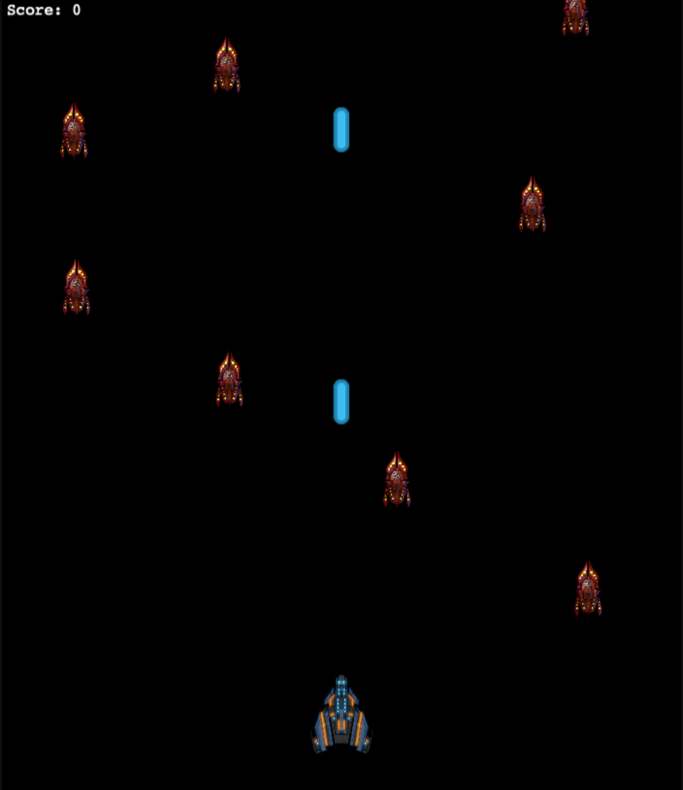

<h1 align="center">
  <br>
  
</h1>

<h1 align="center">Space Shooter</h1>

<p align="center">
  <a href="#about">About</a> •
  <a href="#prerequisites">Prerequisites</a> •
  <a href="#getting-started">Getting Started</a> •
  <a href="#contributing">Contributing</a> •
  <a href="#authors">Authors</a> •
  <a href="#license">License</a>
</p>

---

## About

Space Shooter is a space 2D platformer game. The game include basic game features like collision, movement, obstacles, weapon firing, etc.

## Live Demo

[Click here](https://quirky-shaw-565b76.netlify.app/) to visit the live demo of the application.

## GDD (Game Design Document)

The Game Design Document is a highly descriptive design manual for a video game. It is used to efficiently design and develop a video game. The GDD of this game can be found in the following link.
[Game Design Documentation](./docs/GDD.md)

## Getting Started

### Prerequisites

Before running the application locally, the user will have to make sure of the following:

- Node JS Installed on your local machine. Please use [this link](https://nodejs.org/en/).
- Installing NPM if not already installed.

You also need to make sure that yarn is up to date

- yarn install --check-files

### Getting Started

#### Step 1

https://github.com/cyonii/shooter.git

```
git clone git@github.com:cyonii/shooter.git
```

Alternatively, you can click [this link](https://github.com/cyonii/shooter/archive/refs/heads/game.zip) to download the repo as a zip file.

#### Step 2

Navigate to the game folder

```
cd shooter
```

#### Step 3

Install all the dependencies by running the following command. Dependencies are just normal files and programs that are necessary to run the game.

```
yarn install
```

#### Step 4

While you are in the root folder of the Game, which means that in the topmost folder of the game, run the following command to launch the game in your browser

```
yarn serve
```

Alternatively, you can navigate to the dist folder and run index.html directly in your browser.

### Step 5

## Game Rules

The Game rules are pretty simple.

- You will be spawned in a 2D platform game.
- You have to move left, right, up, and down to avoid enemy spaceships.
- Each enemy eliminated gives you 5 points.
- Your velocity increases as your score points increases.

## How To Play

- After launching the game, you will be asked to enter your name.
- After you have entered the game, you will be spawned in a 2D world.
- To move your spaceship, you can use arrow keys to move around.

## Built With

- Javascript

### Additional Technologies Used

- Phaser Game Library
- Webpack for bundling code
- Babel for Transpiling code
- Jest for testing code

## Testing

As mentioned above, the application uses jest as a primary test runner. To run tests on your local machine, please follow the instructions mentioned below.

- Navigate the project directory
- Run the following command

```
yarn test
```

## Authors

👤 **CY Kalu**

- GitHub: [@cyonii](https://github.com/cyonii)
- LinkedIn: [linkedIn](https://linkedin.com/in/cyonii)

## 🤝Contributing

Contributions, issues, and feature requests are welcome!

## Show your support

Give a ⭐️ if you like this project!

## License

This project is [MIT](./LICENSE) licensed.
